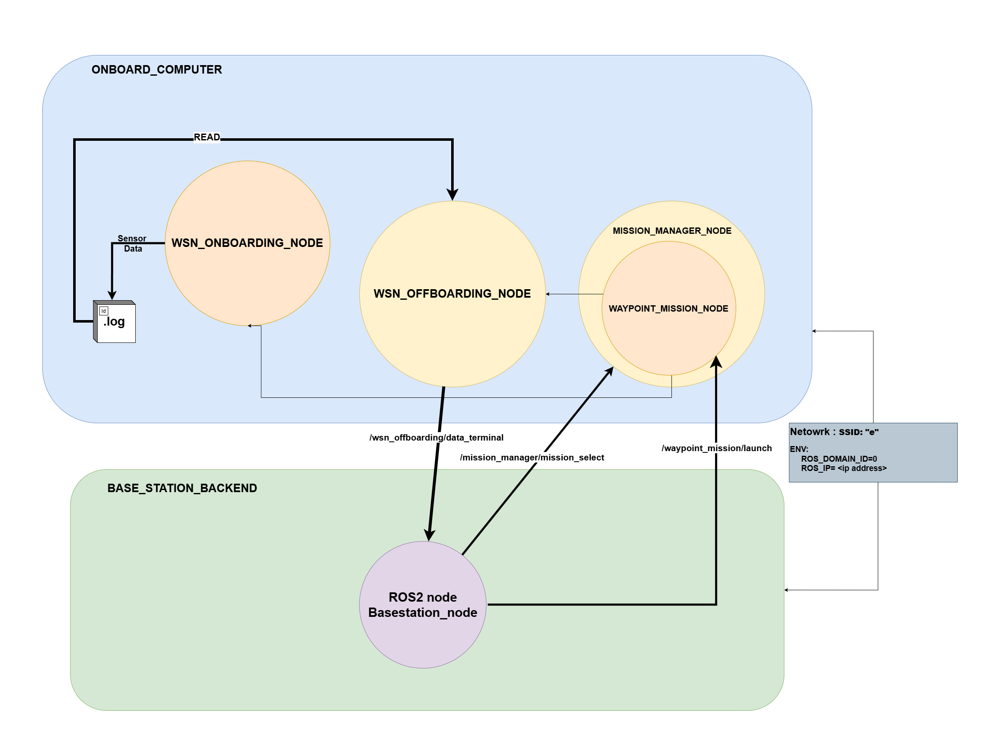
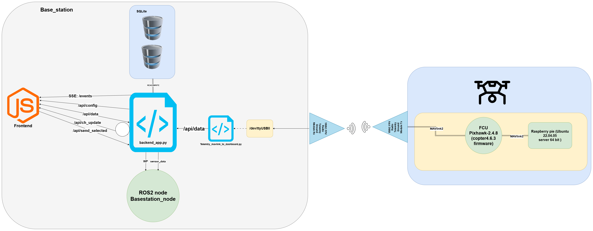

# UAV–WSN Data Collection System

Autonomous drone mission system for collecting data from ground-based Wireless Sensor Network (WSN) nodes using ROS 2 Humble, ArduPilot SITL, MAVROS, and Gazebo.

---

## System Diagrams

### ROS 2 Node Architecture

The diagram below shows the ROS 2 node architecture. Nodes such as `mission_manager`, `waypoint_mission`, and `wsn_onboard_node` are defined in this repository.



### Dashboard & System Overview



---

## Table of Contents

- [System Overview](#system-overview)
- [Prerequisites](#prerequisites)
- [Clone & Setup](#clone--setup)
- [Docker Setup](#docker-setup)
- [Building the Workspace](#building-the-workspace)
- [Running the System](#running-the-system)
- [Package Documentation](#package-documentation)
- [Project Structure](#project-structure)
- [Services Reference](#services-reference)
- [Troubleshooting](#troubleshooting)

---

## System Overview

The system flies a quadcopter through a sequence of WSN sensor nodes. At each node the drone:

1. Navigates to the node's GPS position and descends to loiter altitude
2. Activates RF wake-up to power on the ground sensor
3. Opens a Wi-Fi hotspot for the sensor to connect
4. Collects sensor data via HTTP (Flask API)
5. Confirms data transfer, closes hotspot
6. Resumes flight to the next node
7. Returns to launch after all nodes are visited

### Core Packages

| Package | Description |
|---------|-------------|
| `drone_mission` | Mission manager FSM + waypoint mission flight logic |
| `drone_mission_interfaces` | Custom ROS 2 service definitions (`MissionSelect`, `MissionStatus`) |
| `wsn_onboard` | WSN onboarding node (RF + Wi-Fi + Flask data collection) |

### External Dependencies

| Component | Purpose |
|-----------|---------|
| [ArduPilot SITL](https://ardupilot.org/dev/docs/sitl-simulator-software-in-the-loop.html) | Software-in-the-loop flight simulator |
| [MAVROS](https://github.com/mavlink/mavros) | ROS 2 ↔ MAVLink bridge |
| [Gazebo Garden](https://gazebosim.org/) | 3D simulation environment |
| [Micro-XRCE-DDS-Agent](https://github.com/micro-ROS/micro-ROS-Agent) | DDS bridge for micro-ROS |

---

## Prerequisites

- **Docker** (≥ 20.10) and **Docker Compose** (≥ 2.0)
- **Git**
- A machine with **X11** display support (for Gazebo GUI), or run headless
- At least **8 GB RAM** and **20 GB disk** recommended

---

## Clone & Setup

### 1. Clone the repository

```bash
git clone --recursive <your-repo-url> ~/ros2_ws
cd ~/ros2_ws
```

### 2. Import upstream sources

The workspace uses `vcs` to pull ArduPilot and micro-ROS sources:

```bash
# Install vcstool if needed
pip install vcstool

# Import repos defined in src/ros2.repos
cd ~/ros2_ws
vcs import src < src/ros2.repos
```

---

## Docker Setup

### Option A: Dev Container (VS Code)

If using VS Code with the Dev Containers extension:

1. Open the `ros2_ws` folder in VS Code
2. Press `Ctrl+Shift+P` → **Dev Containers: Reopen in Container**
3. The container will build and start with all dependencies pre-installed

### Option B: Manual Docker Build

```bash
# Build the Docker image
docker build -t uav-wsn-ros2 -f Dockerfile .

# Run the container
docker run -it \
  --name uav-wsn \
  --privileged \
  --network host \
  -e DISPLAY=$DISPLAY \
  -v /tmp/.X11-unix:/tmp/.X11-unix \
  -v $(pwd):/home/dev/ros2_ws \
  uav-wsn-ros2 \
  /bin/bash
```

### Option C: Docker Compose (if available)

```bash
docker compose up -d
docker compose exec ros2 bash
```

### Inside the container

Once inside the container, all ROS 2 Humble tools are available:

```bash
source /opt/ros/humble/setup.bash
```

---

## Building the Workspace

```bash
cd ~/ros2_ws

# Source ROS 2
source /opt/ros/humble/setup.bash

# Build all custom packages
colcon build --packages-select \
  drone_mission_interfaces \
  drone_mission \
  wsn_onboard

# Source the workspace overlay
source install/setup.bash
```

> **Note:** Build `drone_mission_interfaces` first since the other packages depend on it.

To build everything (including ArduPilot Gazebo plugins etc.):

```bash
colcon build
source install/setup.bash
```

---

## Network Architecture (Docker ↔ Raspberry Pi)

For development and SITL testing, the system is split across two machines:

| Machine | IP | Runs |
|---------|-----|------|
| **Laptop** (Docker, `--net=host`) | `192.168.137.60` | SITL, Gazebo, MAVProxy, micro_ros_agent |
| **Raspberry Pi** | `192.168.137.2` | MAVROS, mission_manager, waypoint_mission, wsn_onboard_node |

Communication is over the `192.168.137.0/24` Wi-Fi LAN.

> **Full details:** See [`config/README_NETWORK.md`](config/README_NETWORK.md)
> for step-by-step bring-up, FastDDS discovery configuration, firewall rules,
> and troubleshooting.

### Quick start (split mode)

```bash
# ─── Container (SITL + Gazebo + MAVLink forwarding) ────
source ~/ros2_ws/config/setup_container.bash
ros2 launch drone_mission sitl_gazebo.launch.py

# ─── Pi Terminal 1 (MAVROS → remote SITL) ──────────────
source ~/ros2_ws/config/setup_pi.bash
ros2 launch drone_mission mavros_sitl.launch.py

# ─── Pi Terminal 2 (mission nodes) ─────────────────────
source ~/ros2_ws/config/setup_pi.bash
ros2 launch drone_mission missons.launch.py
```

---

## Running the System (Single Machine / All-Local)

### Step 1: Start ArduPilot SITL

In a separate terminal:

```bash
cd ~/ros2_ws/src/ardupilot

# Copter SITL with default location
sim_vehicle.py -v ArduCopter \
  --map --console \
  -l -35.363261,149.165230,584,0 \
  --out=udp:127.0.0.1:14550
```

### Step 2: Start MAVROS

```bash
source ~/ros2_ws/install/setup.bash

ros2 launch mavros apm.launch \
  fcu_url:=udp://:14550@
```

### Step 3: Launch the mission nodes

```bash
source ~/ros2_ws/install/setup.bash

ros2 launch drone_mission missons.launch.py
```

This starts all three nodes:
- `mission_manager` — FSM executive
- `waypoint_mission` — Flight execution
- `wsn_onboarding_node` — WSN data collection

### Step 4: Trigger a mission

```bash
ros2 service call /mission_manager/mission_select \
  drone_mission_interfaces/srv/MissionSelect \
  "{mission_type: 'waypoint', payload_json: '{
    \"node_001\": {
      \"gps_lat\": -35.363262,
      \"gps_lon\": 149.165237,
      \"height_from_the_ground\": 5.0,
      \"hover\": true
    },
    \"node_002\": {
      \"gps_lat\": -35.363352,
      \"gps_lon\": 149.165237,
      \"height_from_the_ground\": 0.0,
      \"hover\": false
    },
    \"node_003\": {
      \"gps_lat\": -35.363262,
      \"gps_lon\": 149.165347,
      \"height_from_the_ground\": 4.0,
      \"hover\": true
    },
    \"node_004\": {
      \"gps_lat\": -35.363352,
      \"gps_lon\": 149.165347,
      \"height_from_the_ground\": 0.0,
      \"hover\": false
    }
  }'}"
```

### Step 5: Monitor

```bash
# Watch mode changes
ros2 topic echo /mission_manager/mode

# Watch events
ros2 topic echo /mission_manager/event

# Check mission status
ros2 service call /mission_manager/mission_status \
  drone_mission_interfaces/srv/MissionStatus "{}"
```

---

## Package Documentation

| Document | Description |
|----------|-------------|
| [Waypoint Mission](src/drone_mission/docs/WAYPOINT_MISSION.md) | Flight logic, mission generation, waypoint watcher, FSM integration |
| [WSN Onboarding](src/wsn_onboard/docs/WSN_ONBOARDING.md) | RF wake-up, hotspot, Flask API, data dedup, security, re-runnability |

---

## Project Structure

```
ros2_ws/
├── README.md                          ← You are here
├── assets/
│   ├── ros2_node_architecture.png     ← ROS 2 node graph
│   └── dashboard_system_diagram.png   ← System overview diagram
├── config/
│   ├── fastdds_discovery.xml          ← FastDDS unicast peer discovery (copy to both machines)
│   ├── setup_container.bash           ← Source inside Docker container
│   ├── setup_pi.bash                  ← Source on Raspberry Pi
│   └── README_NETWORK.md             ← Full network setup guide
├── src/
│   ├── ros2.repos                     ← VCS import file
│   ├── drone_mission/                 ← Mission manager + waypoint mission
│   │   ├── drone_mission/
│   │   │   ├── mission_manager.py     ← Top-level FSM
│   │   │   ├── missions/
│   │   │   │   ├── waypoint_mission.py ← Waypoint flight logic
│   │   │   │   └── hover_mission.py    ← Hover mission (alternative)
│   │   │   └── launch/
│   │   │       ├── missons.launch.py       ← Launch file for all 3 nodes
│   │   │       ├── mavros_sitl.launch.py   ← MAVROS → remote SITL (Pi)
│   │   │       └── sitl_gazebo.launch.py   ← SITL+Gazebo+fwd (Container)
│   │   ├── docs/
│   │   │   └── WAYPOINT_MISSION.md
│   │   ├── setup.py
│   │   └── package.xml
│   ├── drone_mission_interfaces/      ← Custom srv definitions
│   │   ├── srv/
│   │   │   ├── MissionSelect.srv
│   │   │   └── MissionStatus.srv
│   │   └── CMakeLists.txt
│   ├── wsn_onboard/                   ← WSN data collection node
│   │   ├── wsn_onboard/
│   │   │   └── wsn_onboard_node.py
│   │   ├── docs/
│   │   │   └── WSN_ONBOARDING.md
│   │   ├── setup.py
│   │   └── package.xml
│   ├── ardupilot/                     ← ArduPilot source (via vcs)
│   ├── micro_ros_agent/               ← Micro-XRCE-DDS agent
│   ├── ardupilot_gazebo/              ← Gazebo ArduPilot plugin
│   └── ...
├── build/                             ← colcon build output
├── install/                           ← colcon install overlay
├── log/                               ← colcon build logs
├── mav.parm                           ← ArduPilot parameter file
├── load.txt                           ← Example mission file (QGC WPL)
└── way.txt                            ← Generated waypoint file
```

---

## Services Reference

### `MissionSelect.srv`

```
# Request
string mission_type      # "waypoint" or "hover"
string payload_json      # JSON with WSN node definitions
---
# Response
string accepted          # "True" / "False"
string message
```

### `MissionStatus.srv`

```
# Request
---
# Response
string current_mission   # Active mission type or "None"
string message           # Current FSM mode
```

---

## Troubleshooting

| Issue | Solution |
|-------|----------|
| `colcon build` fails on interfaces | Build interfaces first: `colcon build --packages-select drone_mission_interfaces` |
| MAVROS can't connect to SITL | Ensure SITL is running and `fcu_url` matches the UDP port |
| Gazebo doesn't open | Set `DISPLAY` env variable, or run `xhost +local:docker` on the host |
| `Waiting for MAVROS services...` forever | MAVROS node is not running or not connected to FCU |
| Drone doesn't arm | Check SITL console for pre-arm failures; load `mav.parm` if needed |
| WSN node shows `rpi_rf not available` | Expected in SITL/dev — RF is only available on Raspberry Pi hardware |
| Flask port 8080 already in use | Another instance is running — `kill` it or change the port in `wsn_onboard_node.py` |

---

## License

See individual package `package.xml` files for license information.
